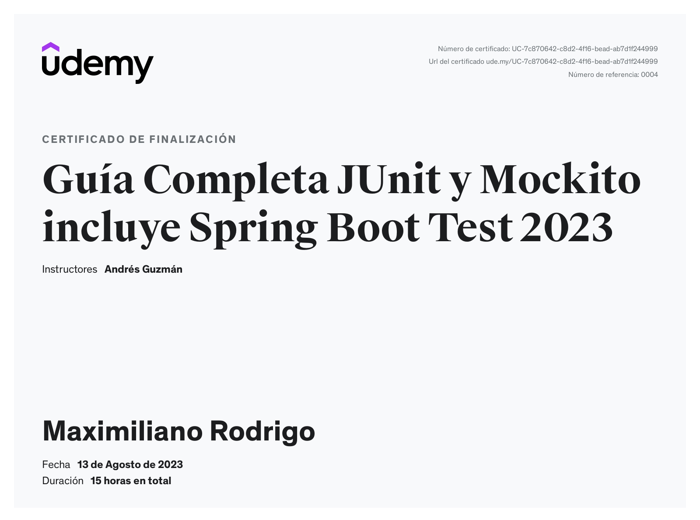

  
  
  

 
 

---
### ⭐ Tabla de proyecto

| Proyecto                     | Descripción                                    |
|------------------------------|------------------------------------------------|
| [Junit 5](/junit5/README.MD) | Pruebas usando Junit 5                         |
| [Mockito](/mockito_app/README.MD)      | Pruebas usando Mockito, mock, verifys, asserts |
| [Junit 5](/springboot_test/README.MD)  | Pruebas usando Spring Boot Test                |

### ⭐ Curso de Udemy

El curso de Udemy es **Guía Completa JUnit y Mockito incluye Spring Boot Test 2023** 

Link: https://www.udemy.com/course/curso-completo-junit-mockito-spring-boot-test

#### Objetivo del curso

Descripción
En este curso aprenderás a escribir desde cero completas pruebas unitarias Java usando JUnit 5 y Mockito con las mejores prácticas TDD y BDD.

**El curso es completamente funcional con versiones de Java 8 y 11, 12, 13, 14, 15, 16 y superiores.**

Hay muchas formas de probar nuestro código, utilizando herramientas de depuración del IDE, o simplemente escribiendo algunas validaciones de nuestro código con sentencias de control e imprimir el resultado en consola o logs, si es una aplicación RESTful usando herramientas como Swagger o Postman, navegador, etc... estas alternativas son excelentes cuando estamos desarrollando nuestra aplicación e intentando depurar cualquier error lógico, pero cualquiera de estos estilos son algo limitado, porque se aplica el juicio humano para analizar el resultado. Por otra parte, nuestras pruebas deberían de tener algo de automatización, un sistema de reportes y sobre todo alguna forma de continuar probando nuestro código en el tiempo, no solo el ahora, sino probar el estado de nuestra aplicación en el futuro y es aquí donde entra el Framework JUnit 5 también conocido como Júpiter (el 5to planeta del sistema solar).

JUnit 5 es un robusto framework java para escribir y ejecutar pruebas unitarias, un proceso de examen que nos permite verificar que una pieza de código cumple con las reglas de negocio y afirmar un comportamiento esperado, además de automatizar mas el proceso, es decir en una sola ejecución podemos realizar varias pruebas y para los distintos escenarios posibles, incluso repetir o parametrizar una prueba con diferentes parámetros de entradas de una sola vez, ejecuciones condicionales, manejo y confirmaciones de excepciones, uso extensivo de anotaciones y todas las bondades y características de Java 8 como es el API Stream, expresiones lambda, programación funcional y mucho más.

También aprenderemos con detalle a escribir pruebas unitarias en Spring Boot 3, usando e integrando Mockito, JUnit5, MockMvc y pruebas de integración. Spring Boot es el framework más popular y robusto para desarrollar aplicaciones web y servicios RESTful, además cuenta con una completa integración con unit testing a través de Spring Boot Starter Test, que incluye el framework de JUnit 5 y Mockito, ambos framework de pruebas unitarias más populares y robustos de Java.

Finalmente como complemento y anexo, aprenderemos a consumir y probar nuestros servicios web RESTful con Swagger.

 
 

### ⭐ License

[Apache 2.0](http://springdoc.org)

 
 

### ⭐ Certificado

> [!NOTE]
> Puedes ingredar al certificado dando click en la imagen
---
 

### ⭐ Autor
 

> ‍💻 **Nombre:** Maximiliano Rodrigo Soria
>
> 📧 **Email:** MaximilianoRodrigoSoria@gmail.com
>
> 🏠 **De:** Florencio Varela, Alpino
>
> 💼 **Linkedin:** [SoriaMaximilianoRodrigo](https://www.linkedin.com/in/soriamaximilianorodrigo/)
>
> 💬 **Chat:**  [Inicia un chat](https://wa.me/1127043256)

